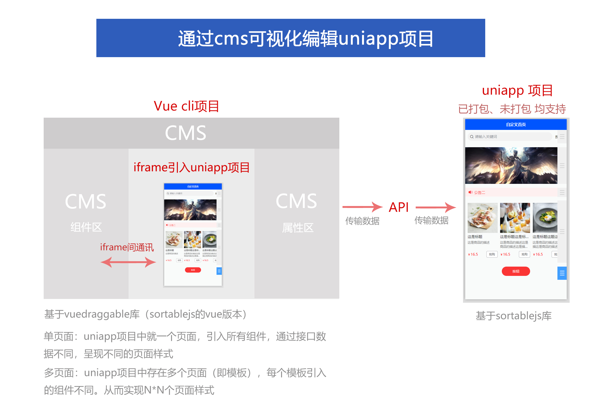

#   可视化编辑uniapp项目DIY拖拽

通过CMS可视化编辑uniapp，原理只是操作组件的排序和属性。
如你的原项目需要加上可视化编辑，只需要规范转化组件，即可轻松实现
**项目刚上线还有很多不足，不断优化完善，不喜勿喷！**

> 常见的DIY可视化，就是cms端放ABC组件，前端也放ABC组件；最后通过数据库保存的ID和参数来 显示及排序；
> 咱们这个可视化，cms端不放组件，通过iframe传值改变前端ABC组件，但最后也是通过数据库保存的ID和参数来 显示及排序； 
> 优点就是cms不需要放组件，uniapp插件市场的绝大部分组件可以快速引入来实现可视化；

QQ群：728615087
gitee: https://gitee.com/qianyu_wyc/uni-diy

项目分为cms端、uniapp项目端
###	安装步骤
1、uniapp项目终端执行安装命令：	npm install   
  不要用cnpm 安装
2、运行uniapp到浏览器，得到网址：http://localhost:8081/ 
  如果不是这个网址的话，需要到cms端的main.js中去配置
3、cms端执行安装命令：	npm install   
  运行：npm run serve

cms自定义页面->保存数据到API->uniapp从API接口获取数据->显示页面布局及样式  
为了便于大家演示，数据并未从后端获取，而是固定的测试数据；所以页面数据是无法保存的，可以自行编写API端；
需要接口版+PHP端api可以加群获取

###	陆续更新：
1、丰富的组件库
2、unicloud版的API端
3、多页面+多主题

